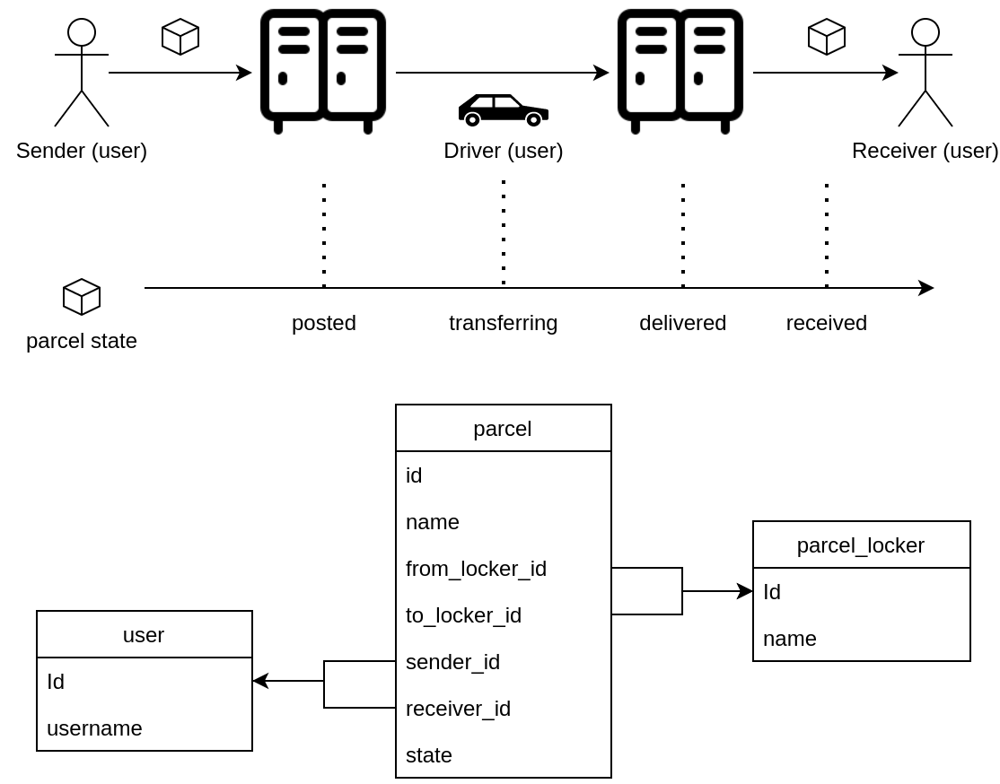

# Programowanie aplikacji mobilnych i webowych

Repozytorium zawierające notatki z poszczególnych laboratoriów.

## Database diagram



## Docker compose

### Build

```
docker compose build
```

### Run

#### Run all

```
docker compose up
```

#### Run database only

```
docker compose up db
```

#### Build & run backend in detach mode

```
docker compose up backend --build -d
```

### Stop

```
docker compose down
```

## Curl examples

### Get

```
curl -v http://127.0.0.1:8080/parcels -H 'Content-type:application/json'
```

### POST

```
curl -v -X POST http://127.0.0.1:8080/parcels -H 'Content-type:application/json' -d '{"name":"Parcel v1.0"}'
```

### PUT

```
curl -v -X PUT  http://127.0.0.1:8080/parcels/1 -H 'Content-type:application/json' -d '{"id":1, "name":"Parcel v1.1"}'
```

### DELETE

```
curl -v -X DELETE  http://127.0.0.1:8080/parcels/1 -H 'Content-type:application/json'
```
